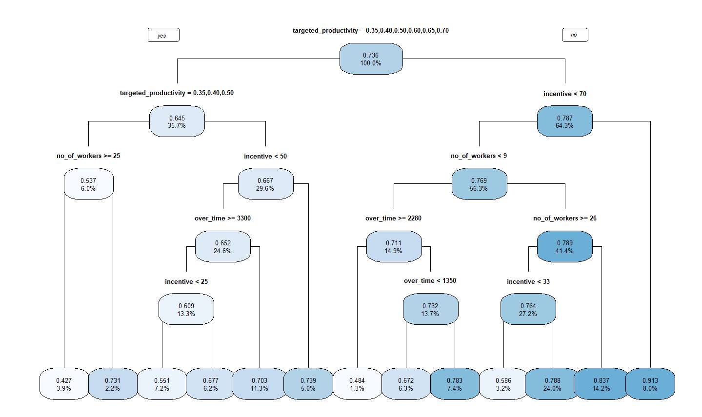

```{r global_options, include=FALSE}
knitr::opts_chunk$set(
    warning = FALSE,
    fig.align = "center",
    fig.width = 18,
    fig.height = 12,
    out.width = "100%",
    results = "hold",
    collapse = TRUE,
    message = FALSE,
    warning = FALSE
)
```

# Introduction

The Garment Industry is one of the key examples of the industrial globalization
of this modern era. It is a highly labour-intensive industry with lots of
manual processes. Satisfying the huge global demand for garment products is
mostly dependent on the production and delivery performance of the employees in
the garment manufacturing companies.

So, it is highly desirable among the decision makers in the garments industry
to track, analyse and predict the productivity performance of the working teams
in their factories.

Objective: Analyze current data and propose a productivity prediction model.

# Data Description

#### Dataset {.unnumbered}

Productivity Prediction of Garment Employees [Dataset]. (2020). UCI Machine
Learning Repository. <https://doi.org/10.24432/C51S6D>.

#### Dimensions {.unnumbered}

1197 observations, 15 variables

#### Data Dictionary {.unnumbered}

+------------------+------------------+--------------------------------------+
| header           | type             | description                          |
+==================+==================+======================================+
| date             | Date             | Date in MM-DD-YYYY                   |
+------------------+------------------+--------------------------------------+
| day              | Category         | Day of the Week                      |
+------------------+------------------+--------------------------------------+
| quarter          | Category         | A portion of the month. A month was  |
|                  |                  | divided into four quarters           |
+------------------+------------------+--------------------------------------+
| department       | Category         | Associated department with the       |
|                  |                  | instance                             |
+------------------+------------------+--------------------------------------+
| team_no          | Category         | Associated team number with the      |
|                  |                  | instance                             |
+------------------+------------------+--------------------------------------+
| no_of_workers    | Numeric          | Number of workers in each team       |
+------------------+------------------+--------------------------------------+
| no               | Numeric          | Number of changes in the style of a  |
| _of_style_change |                  | particular product                   |
+------------------+------------------+--------------------------------------+
| targe            | Category         | Targeted productivity set by the     |
| ted_productivity |                  | Authority for each team for each     |
|                  |                  | day.                                 |
+------------------+------------------+--------------------------------------+
| smv              | Numeric          | Standard Minute Value, it is the     |
|                  |                  | allocated time for a task            |
+------------------+------------------+--------------------------------------+
| wip              | Numeric          | Work in progress. Includes the       |
|                  |                  | number of unfinished items for       |
|                  |                  | products                             |
+------------------+------------------+--------------------------------------+
| over_time        | Numeric          | Represents the amount of overtime by |
|                  |                  | each team in minutes                 |
+------------------+------------------+--------------------------------------+
| incentive        | Numeric          | Represents the amount of financial   |
|                  |                  | incentive (in BDT) that enables or   |
|                  |                  | motivates a particular course of     |
|                  |                  | action.                              |
+------------------+------------------+--------------------------------------+
| idle_time        | Numeric          | The amount of time when the          |
|                  |                  | production was interrupted due to    |
|                  |                  | several reasons                      |
+------------------+------------------+--------------------------------------+
| idle_men         | Numeric          | The number of workers who were idle  |
|                  |                  | due to production interruption       |
+------------------+------------------+--------------------------------------+
| act              | Numeric          | The actual % of productivity that    |
| ual_productivity |                  | was delivered by the workers. It     |
|                  |                  | ranges from 0-1.                     |
+------------------+------------------+--------------------------------------+

#### Missing Data {.unnumbered}

There are 506 observations with missing value (42%) on `wip` variable. This
observations corresponds to 'finishing' category on `department` variable.

#### Session Info {.unnumbered}

```{r eval=FALSE, include=FALSE}
session.info <- capture.output(utils::sessionInfo())
info <- utils::sessionInfo()
grep("R version", session.info, value = TRUE)
grep("Platform", session.info, value = TRUE)
cat("\nOther Packages:\n")
print(names(info$otherPkgs))
```

```r
[1] "R version 4.4.1 (2024-06-14 ucrt)"
[1] "Platform: x86_64-w64-mingw32/x64"

Other Packages:
 [1] "Metrics"      "ggpubr"       "Cubist"       "rpart.plot"   "rpart"       
 [6] "psych"        "leaps"        "kernlab"      "ROCR"         "caret"       
[11] "lattice"      "car"          "carData"      "randomForest" "skimr"       
[16] "GGally"       "ggstatsplot"  "patchwork"    "lubridate"    "forcats"     
[21] "stringr"      "dplyr"        "purrr"        "readr"        "tidyr"       
[26] "tibble"       "ggplot2"      "tidyverse"    "data.table" 
```


#### R Libraries {.unnumbered}

```{r}
library(data.table)     # to read dataset
library(tidyverse)      # data wrangling and ggplot2
library(patchwork)      # a ggplot extension
library(ggstatsplot)    # a ggplot extension
library(GGally)         # a ggplot extension
library(ggpubr)         # a ggplot extension
library(skimr)          # descriptive analysis
library(car)            # Statistical Analysis
library(Metrics)        # Evaluation Metrics for Machine Learning
library(randomForest)   # Random Forest
library(caret)          # various predictive analysis
library(ROCR)           # ROC curve
library(Cubist)         # Cubist Model Tree
library(rpart)          # Regression Trees
library(rpart.plot)     # Tree plot for rpart
library(psych)          # Principal Components Analysis
library(leaps)          # Linear regression 
library(kernlab)        # Support Vector Machines
```

# Exploratory Data Analysis

EDA of a complete dataset with missing values in 42% of the observation on
`wip` variable. Since `wip` means 'work in progress' for the number of items
unfinished, and every missing value corresponds to 'finishing' category for
`department` variable, It has been deduced that value has to be 0 because the
team has finished their work thus there are not unfinished items, then `wip` is
0.

Also It has been found a technical error on `quarter` variable. It represents 4
quarters of a month but there are 5 levels from Quarter1 to Quarter5. In every
month days 29-31 are labeled as Quarter5, then it have been recoded to
Quarter4. A typographical error was found in `targeted_productivity` with a
value of 0.07 which is unlikely correct, it was replaced by 0.70 being the
second most repeated value.

The descriptive statistics show high variances due to the presence of outliers.
It can be seen a reasonable dispersion on `actual_productivity` variable;
`no_of_workers`, `over_time`, and `smv` have high dispersion, and the rest of
variables suggests outliers. For almost every variable the data is right skewed
and leptokurtic except `actual_productivity` which visually is near normal
left-skewed.

The teams which achieve `targeted_productivity` represents 73% of the sample.
Also it can be seen differences in both groups being those who achieved the
`target_productivity` are the ones with the highest median
`actual_productivity`.

The variables `smv`, `wip`, `over_time`, `incentive`, `no_of_workers`, and
`actual_productivity` have the greater differences in median with more effect
size, this suggests high importance in order to perform classification
prediction (except `actual_productivity` which will be the target).

```{r echo=FALSE}
readRDS("../summary-skim.rds")
```


Teams 03, 01, 06, and 04 have the highest achieve rate (\>80%) whereas teams
08, 07, 06, and 09 have a lack of achieve productivity (33-45% 'unsuccess').
Also, 07 and 08 teams have no significance, thus suggests that productivity in
these two teams is not being significantly influenced by the variable `team`.
Chi-square suggests that there is a relationship between productivity and
teamwork in teams with p \< 0.05.

Comparing teams 07 and 08 with the rest of teams: The results suggest that
those teams (07 and 08) that have been observed to be less productive by not
meeting target productivity have significantly lower incentives.

No significant differences in `over_time` or `no_of_workers` were observed
comparing the teams. However, in `no_of_style_change` significant differences
have been observed, being the teams with the lowest productivity the ones with
the highest style changes.


An inverse relationship (`r: -0.207`) can be seen between `actual_productivity`
and `no_of_style_change`, so the more style changes the lower the productivity.

# Modeling

The following classification algorithms have been selected for the modeling:
Random Forest, Logistic Regression, and Support Vector Machines. To perform the
classification, a target variable has been created, being '1' when the current
productivity exceeds the target productivity. This will try to predict, given
the variables selected from the dataset, whether a team will tend to exceed the
target productivity.

The regression algorithms selected to predict the productivity value given a
set of characteristics are: Exhaustive Stepwise Regression, Robust Linear
Regression, Random Forest Regression, Regression Trees, and Cubist Model Tree.

## Classification

-   Accuracy: The overall accuracy of the model, which is calculated as the
    ratio of correct predictions to total predictions.
-   Recall: refers to 'Sensitivity', which is calculated as the proportion of
    true positives over the total number of true and false positives.
-   Precision: refers to 'Pos Pred Value', which is calculated as the proportion
    of true positives over the total of true positives and false positives.
-   Kappa: The kappa coefficient, which measures the agreement between
    predictions and actual labels.
-   Detection Rate: The detection rate, which is calculated as the ratio of
    true positives over total predictions.
-   AUC: Ability of the model to distinguish between positive and negative
    classes. Probability that a positive example will be classified with a
    higher score than a negative example.

|                    | Random Forest | MC-RF        | Logistic Regression | SVM          |
|--------------------|---------------|--------------|---------------------|--------------|
| **Accuracy**       | 0.803         | 0.798        | 0.741               | 0.735        |
| **Recall**         | 0.902         | 0.902        | 0.887               | 0.971        |
| **Precision**      | 0.839         | 0.834        | 0.789               | 0.743        |
| **Kappa**          | 0.47          | 0.455        | 0.237               | 0.106        |
| **Detection Rate** | 0.655         | 0.655        | 0.657               | 0.706        |
| **AUC**            | 0.816         | 0.832        |                     | 0.672        |

## Regression

-   Coefficient of determination (R-squared): Measures the proportion of the
    variability in the dependent variable that is explained by the model. In
    general, a **high R-squared value** indicates that the model is good. It
    measures the goodness of fit of the model.
-   Root Mean Square Error (RMSE): Measures the square root of the mean of the
    squared errors between the model predictions and the actual values. A **low
    RMSE value** indicates that the model is accurate. It measures the accuracy
    of the model.
-   Mean squared error (MSE): Measures the mean squared errors between model
    predictions and actual values. A **low MSE value** indicates that the model
    is accurate. It measures the accuracy of the model.
-   Mean Absolute Error (MAE): Measures the mean of the absolute errors between
    model predictions and actual values. A **low MAE value** indicates that the
    model is accurate. It measures model accuracy more robustly than RMSE and
    MSE.

|                     | R^2          | RMSE         | MSE          | MAE          |
|---------------------|--------------|--------------|--------------|--------------|
| **Stepwise** *      | 0.300        |              |              |              |
| **LR Multiple** *   | 0.247        | 0.150        | 0.0226       | 0.1088       |
| **Robust LR**       | 0.213        | 0.1499       | 0.02247      | 0.1066       |
| **RF Regression**   | 0.4193       | 0.1288       | 0.01658      | 0.08681      |
| **Regression Tree** | 0.4403       | 0.1369       | 0.01875      | 0.09652      |
| **Cubist Tree** *   | 0.3902       | 0.132        | 0.01741      | 0.08411      |
* Non-compliance with assumptions

# Results

In general, all the algorithms used for classification have an adequate 'Accuracy' but there are differences in the values of each algorithm when it comes to discerning True Negatives. Both Random Forest and Monte-Carlo with Random Forest have the highest 'Accuracy' (0.803 & 0.798 vs. 0.735) although the 'Detection Rate' is higher for SVM (0.706 vs. 0.655). Considering all values, the highest consistency is for Random Forest which would classify approximately 66% of the predictions correctly.


Thanks to multiple linear regression we can see influential variables that will help us to understand the regression tree more easily later on. First, '(Intercept)' is the estimated value if all independent variables are 0 (no influence on the dependent variable), being a value of 0.593. Then, in `targeted_productivity` the categories of '0.75' and '0.80' are the most influential in increasing `actual_productivity.` Finally, another variable to highlight is `incentive`, which also helps to increase `actual_productivity.`


On the other hand, as in the classification, decision trees would be the best option to predict the value of `actual_productivity`, both Random Forest Regression and Regression tree. As they are robust models, it has not been necessary to scale the values, so that the decisions taken are directly evaluated with the given values. The fit with the Coefficient of Determination is not too high (0.42 & 0.44) although the rest of the values are acceptable (the smaller the better). 



Taking Regression Tree as an example, its most direct branch indicates that, if `targeted_productivity` is '0.75' or '0.80' and the `incentive` is greater than 70, the expected value of `actual_productivity` would be 0.913. Following this decision making process, we could easily predict the expected values according to the characteristics of the teams.

# Conclussion

The high variability of the data has been observed in its analysis, both due to its standard deviation and atypical values. The high correlation found between the variables `smv`, `wip` and `no_or_workers` should be taken into account, so much so that it implies multicollinearity according to the VIF test (values greater than 10). In general, it could be said that productivity is positively influenced by the incentive as well as when a high target productivity is indicated. Productivity is also negatively influenced when there are changes in the style of the product, as can be seen in teams 06 to 09, which achieved the target productivity less often than the rest.

## Limitations

The main limitation is the sample size, since a larger size would make it easier for us to use other Machine Learning algorithms and would also give more consistency to the analysis. Moreover, the data provided was biased, which also has to do with the sample size; this could be partially solved with bootstrapping. The dataset has been provided to the analysts and not collected by them, therefore we can only speak of an *ex-post-facto* study, no causality can be found with these data. 

Finally, it is considered difficult to generalize in the case of predictions since it has to be fulfilled with a dataset with the same variables. On the other hand, the general conclusions could be generalized to other samples, although more research would be recommended before that.

## Future directions

If possible in deployment, to make more accurate predictions of current productivity, the parallel use of Random Forest for classification and Regression Tree to predict the value might be appropriate. While the classification would indicate whether or not the new prediction would meet the productivity, the regression would assess what score it could achieve. It would be a way to confirm the prediction of one model with the other and vice versa.


