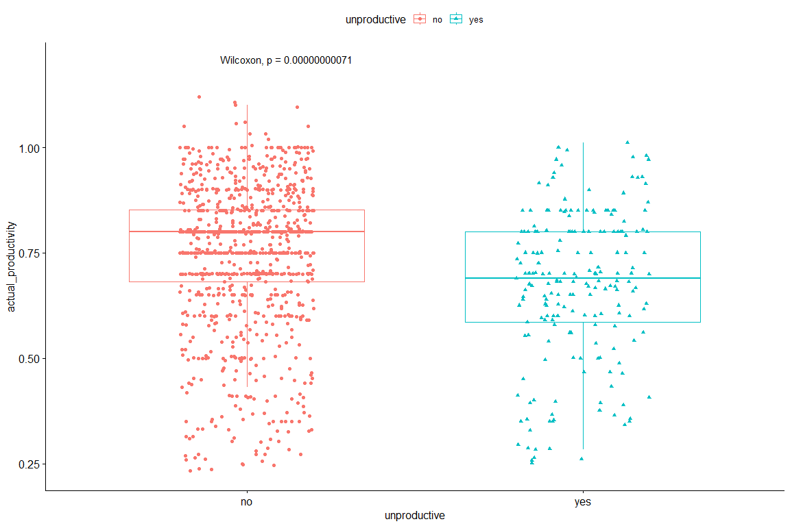

Productivity Prediction
================
Alvaro Manzanas
22 September, 2024

- [1 Loading Data](#1-loading-data)
  - [1.1 Key Variable](#11-key-variable)
  - [1.2 Column Classes](#12-column-classes)
- [2 Data Cleaning](#2-data-cleaning)
  - [2.1 Duplicates and Missing
    Values](#21-duplicates-and-missing-values)
  - [2.2 Unique values for
    characters/factors](#22-unique-values-for-charactersfactors)
- [3 Exploration](#3-exploration)
  - [3.1 Creating target variable](#31-creating-target-variable)
  - [3.2 Boxplots](#32-boxplots)
    - [3.2.1 Multiple Comparisons](#321-multiple-comparisons)
  - [3.3 Correlations](#33-correlations)
  - [3.4 Team Comparisons](#34-team-comparisons)
- [4 Modeling](#4-modeling)
  - [4.1 Classification](#41-classification)
    - [4.1.1 Random Forest](#411-random-forest)
    - [4.1.2 Logistic Regression](#412-logistic-regression)
    - [4.1.3 Support Vector Machines](#413-support-vector-machines)
  - [4.2 Regressions](#42-regressions)
    - [4.2.1 Linear Regression
      Stepwhise](#421-linear-regression-stepwhise)
    - [4.2.2 Multiple Linear
      Regression](#422-multiple-linear-regression)
    - [4.2.3 Robust Linear Regression](#423-robust-linear-regression)
    - [4.2.4 Random Forest](#424-random-forest)
    - [4.2.5 Regression Trees](#425-regression-trees)
    - [4.2.6 Cubist Model Tree](#426-cubist-model-tree)

``` r
library(data.table)     # to read dataset
library(tidyverse)      # data wrangling and ggplot2
library(patchwork)      # a ggplot extension
library(ggstatsplot)    # a ggplot extension
library(GGally)         # a ggplot extension
library(ggpubr)         # a ggplot extension
library(skimr)          # descriptive analysis
library(car)            # Statistical Analysis
library(Metrics)        # Evaluation Metrics for Machine Learning
library(randomForest)   # Random Forest
library(caret)          # various predictive analysis
library(ROCR)           # ROC curve
library(Cubist)         # Cubist Model Tree
library(rpart)          # Regression Trees
library(rpart.plot)     # Tree plot for rpart
library(psych)          # Principal Components Analysis
library(leaps)          # Linear regression 
library(kernlab)        # Support Vector Machines
```

# 1 Loading Data

``` r
library(data.table)

df <- fread(file = "../data/garments_worker_productivity.csv")
df <- as.data.frame(df, stringsAsFactor = FALSE)
df.original <- df
head(df)
```

<div class="kable-table">

| date | quarter | department | day | team | targeted_productivity | smv | wip | over_time | incentive | idle_time | idle_men | no_of_style_change | no_of_workers | actual_productivity |
|:---|:---|:---|:---|---:|---:|---:|---:|---:|---:|---:|---:|---:|---:|---:|
| 1/1/2015 | Quarter1 | sweing | Thursday | 8 | 0.80 | 26.16 | 1108 | 7080 | 98 | 0 | 0 | 0 | 59.0 | 0.9407254 |
| 1/1/2015 | Quarter1 | finishing | Thursday | 1 | 0.75 | 3.94 | NA | 960 | 0 | 0 | 0 | 0 | 8.0 | 0.8865000 |
| 1/1/2015 | Quarter1 | sweing | Thursday | 11 | 0.80 | 11.41 | 968 | 3660 | 50 | 0 | 0 | 0 | 30.5 | 0.8005705 |
| 1/1/2015 | Quarter1 | sweing | Thursday | 12 | 0.80 | 11.41 | 968 | 3660 | 50 | 0 | 0 | 0 | 30.5 | 0.8005705 |
| 1/1/2015 | Quarter1 | sweing | Thursday | 6 | 0.80 | 25.90 | 1170 | 1920 | 50 | 0 | 0 | 0 | 56.0 | 0.8003819 |
| 1/1/2015 | Quarter1 | sweing | Thursday | 7 | 0.80 | 25.90 | 984 | 6720 | 38 | 0 | 0 | 0 | 56.0 | 0.8001250 |

</div>

## 1.1 Key Variable

``` r
library(tidyverse)

vec.key <- c(paste(sprintf("%04.0f", seq(1:nrow(df)) ),
                   sprintf("%02.0f", round(df$team, 0)),
                   sep="_") )

df <- bind_cols(vec.key, df)
remove(vec.key)

colnames(df)[1] <- c("id")
```

## 1.2 Column Classes

``` r
glimpse(df)
## Rows: 1,197
## Columns: 16
## $ id                    <chr> "0001_08", "0002_01", "0003_11", "0004_12", "000…
## $ date                  <chr> "1/1/2015", "1/1/2015", "1/1/2015", "1/1/2015", …
## $ quarter               <chr> "Quarter1", "Quarter1", "Quarter1", "Quarter1", …
## $ department            <chr> "sweing", "finishing", "sweing", "sweing", "swei…
## $ day                   <chr> "Thursday", "Thursday", "Thursday", "Thursday", …
## $ team                  <int> 8, 1, 11, 12, 6, 7, 2, 3, 2, 1, 9, 10, 5, 10, 8,…
## $ targeted_productivity <dbl> 0.80, 0.75, 0.80, 0.80, 0.80, 0.80, 0.75, 0.75, …
## $ smv                   <dbl> 26.16, 3.94, 11.41, 11.41, 25.90, 25.90, 3.94, 2…
## $ wip                   <int> 1108, NA, 968, 968, 1170, 984, NA, 795, 733, 681…
## $ over_time             <int> 7080, 960, 3660, 3660, 1920, 6720, 960, 6900, 60…
## $ incentive             <int> 98, 0, 50, 50, 50, 38, 0, 45, 34, 45, 44, 45, 50…
## $ idle_time             <dbl> 0, 0, 0, 0, 0, 0, 0, 0, 0, 0, 0, 0, 0, 0, 0, 0, …
## $ idle_men              <int> 0, 0, 0, 0, 0, 0, 0, 0, 0, 0, 0, 0, 0, 0, 0, 0, …
## $ no_of_style_change    <int> 0, 0, 0, 0, 0, 0, 0, 0, 0, 0, 0, 0, 0, 0, 0, 0, …
## $ no_of_workers         <dbl> 59.0, 8.0, 30.5, 30.5, 56.0, 56.0, 8.0, 57.5, 55…
## $ actual_productivity   <dbl> 0.9407254, 0.8865000, 0.8005705, 0.8005705, 0.80…
```

``` r
    ## Change date and team classes
df <- df %>% 
    mutate( team = print(sprintf("%02.0f", team)) ) %>%
    mutate_at( "date", as.Date, format = "%m/%d/%Y")

    ## Round no_of_workers and changing class
df <- df %>%
    mutate( no_of_workers = ceiling(no_of_workers) ) %>%
    mutate_at( "no_of_workers", as.integer)

table(df$targeted_productivity) 
    # there is a value '0.07' which is unlikely to
    # be correct, could be a typographical error for '0.70' 
df <- df %>% mutate( 
    targeted_productivity = ifelse(targeted_productivity==0.07, 
                                   0.70, targeted_productivity) )
```

# 2 Data Cleaning

``` r
# Enabling 'just in time' compilation
compiler::enableJIT(3)

# Changing scientific notion
options( scipen = 999, digits = 4 )
```

## 2.1 Duplicates and Missing Values

``` r
# Check duplicates
anyDuplicated(df[,2:ncol(df)])

# Check Missing Values
anyNA(df)
## [1] 0
## [1] TRUE
```

``` r
for (var in colnames(df)){
    print(
        paste(var, sum(is.na(df[var]) ) )
    )
}
## [1] "id 0"
## [1] "date 0"
## [1] "quarter 0"
## [1] "department 0"
## [1] "day 0"
## [1] "team 0"
## [1] "targeted_productivity 0"
## [1] "smv 0"
## [1] "wip 506"
## [1] "over_time 0"
## [1] "incentive 0"
## [1] "idle_time 0"
## [1] "idle_men 0"
## [1] "no_of_style_change 0"
## [1] "no_of_workers 0"
## [1] "actual_productivity 0"
```

``` r
df.na <- df[which(is.na(df$wip)),]

df.na %>% select(team, department, date, wip, actual_productivity) %>% .[11:20,]
table(df$department) # Same number of rows on department-finishing

    ## Answering: department == finishing, means wip == NA ?

df.dep.filt <- df %>% filter(department == "finishing")
all.equal( df.dep.filt$id, df.na$id ) # TRUE
remove(df.dep.filt)
remove(df.na)
```

<div class="kable-table">

|     | team | department | date       | wip | actual_productivity |
|-----|:-----|:-----------|:-----------|----:|--------------------:|
| 23  | 03   | finishing  | 2015-01-03 |  NA |              0.9453 |
| 24  | 01   | finishing  | 2015-01-03 |  NA |              0.9029 |
| 34  | 02   | finishing  | 2015-01-03 |  NA |              0.7824 |
| 36  | 10   | finishing  | 2015-01-03 |  NA |              0.7018 |
| 39  | 08   | finishing  | 2015-01-03 |  NA |              0.6283 |
| 40  | 07   | finishing  | 2015-01-03 |  NA |              0.6253 |
| 41  | 03   | finishing  | 2015-01-04 |  NA |              0.9914 |
| 42  | 09   | finishing  | 2015-01-04 |  NA |              0.9316 |
| 43  | 01   | finishing  | 2015-01-04 |  NA |              0.9152 |
| 45  | 04   | finishing  | 2015-01-04 |  NA |              0.8617 |

</div>

    ## 
    ## finishing    sweing 
    ##       506       691 
    ## [1] TRUE

``` r
# filling NA values with 0 (if the team finish, then no wip)

df.clean <- df %>% replace_na( list( wip = 0) )
anyNA(df.clean) # FALSE
## [1] FALSE
```

## 2.2 Unique values for characters/factors

``` r
# Checking unique values

for (var in colnames(df.clean[,-1])){
    if( is.character(df.clean[, var])){
        print( paste(var, unique(df.clean[, var]) ) )
    }
} # There are 5 Quarters.
## [1] "quarter Quarter1" "quarter Quarter2" "quarter Quarter3" "quarter Quarter4"
## [5] "quarter Quarter5"
## [1] "department sweing"    "department finishing"
## [1] "day Thursday"  "day Saturday"  "day Sunday"    "day Monday"   
## [5] "day Tuesday"   "day Wednesday"
##  [1] "team 08" "team 01" "team 11" "team 12" "team 06" "team 07" "team 02"
##  [8] "team 03" "team 09" "team 10" "team 05" "team 04"
```

``` r
filt.quarter <- df.clean %>% 
    select(id, date, quarter) %>% 
    filter(quarter == "Quarter5") 
# Days 29, 30 and 31 are labeled as Quarter5, should be Quarter4
slice_sample(filt.quarter, n=10)
remove(filt.quarter)
```

<div class="kable-table">

| id      | date       | quarter  |
|:--------|:-----------|:---------|
| 0508_01 | 2015-01-29 | Quarter5 |
| 0511_05 | 2015-01-29 | Quarter5 |
| 0516_06 | 2015-01-29 | Quarter5 |
| 0537_12 | 2015-01-31 | Quarter5 |
| 0540_06 | 2015-01-31 | Quarter5 |
| 0533_10 | 2015-01-31 | Quarter5 |
| 0509_01 | 2015-01-29 | Quarter5 |
| 0515_11 | 2015-01-29 | Quarter5 |
| 0499_02 | 2015-01-29 | Quarter5 |
| 0504_06 | 2015-01-29 | Quarter5 |

</div>

``` r
df.clean <- df.clean %>% 
    mutate(
        quarter = replace(quarter, quarter == "Quarter5", "Quarter4")
    )
```

# 3 Exploration

``` r
# Exploring the data with histograms
for (var in colnames(select_if(df.clean[,1:ncol(df.clean)], is.numeric) ) ) {
    hist( unlist( df.clean[,var]), col = "blue",
          main = paste("Histogram of", var),
          xlab = var)
}   # Target_productivity and actual_productivity have left tail
```


``` r
    # and actual_productivity is close to normal distribution
    # The rest of variables have right tail
    # except no_of_worker which seems to be mesokurtic
```

## 3.1 Creating target variable

``` r
# Creating a target variable for productivity
df.clean <- df.clean %>% mutate( 
    productivity_cat = ifelse(actual_productivity >= targeted_productivity,
                              "achieved", "unsuccess") )
df.clean$productivity_cat <- as.factor(df.clean$productivity_cat)
```

``` r
summ <- skim(df.clean)
summ %>% 
    filter(skim_type == "numeric") %>%
    mutate( cv = numeric.sd / numeric.mean )
    # For incentive, idle_time, idle_men, no_of_style_change the p75 are near 0 or 0
        # also this variables have high CV (coefficient of variation)
    # Most of variables have high standard deviation which suggest outliers and
        # spread data
    # 875 (73.1%) achieve the target productivity 

table( df.clean$productivity_cat)
```

|                                                  |          |
|:-------------------------------------------------|:---------|
| Name                                             | df.clean |
| Number of rows                                   | 1197     |
| Number of columns                                | 17       |
| \_\_\_\_\_\_\_\_\_\_\_\_\_\_\_\_\_\_\_\_\_\_\_   |          |
| Column type frequency:                           |          |
| numeric                                          | 10       |
| \_\_\_\_\_\_\_\_\_\_\_\_\_\_\_\_\_\_\_\_\_\_\_\_ |          |
| Group variables                                  | None     |

Data summary

**Variable type: numeric**

| skim_variable | n_missing | complete_rate | mean | sd | p0 | p25 | p50 | p75 | p100 | hist | cv |
|:---|---:|---:|---:|---:|---:|---:|---:|---:|---:|:---|---:|
| targeted_productivity | 0 | 1 | 0.73 | 0.10 | 0.35 | 0.70 | 0.75 | 0.80 | 0.80 | ▁▁▁▃▇ | 0.13 |
| smv | 0 | 1 | 15.06 | 10.94 | 2.90 | 3.94 | 15.26 | 24.26 | 54.56 | ▇▅▃▁▁ | 0.73 |
| wip | 0 | 1 | 687.23 | 1514.58 | 0.00 | 0.00 | 586.00 | 1083.00 | 23122.00 | ▇▁▁▁▁ | 2.20 |
| over_time | 0 | 1 | 4567.46 | 3348.82 | 0.00 | 1440.00 | 3960.00 | 6960.00 | 25920.00 | ▇▆▁▁▁ | 0.73 |
| incentive | 0 | 1 | 38.21 | 160.18 | 0.00 | 0.00 | 0.00 | 50.00 | 3600.00 | ▇▁▁▁▁ | 4.19 |
| idle_time | 0 | 1 | 0.73 | 12.71 | 0.00 | 0.00 | 0.00 | 0.00 | 300.00 | ▇▁▁▁▁ | 17.41 |
| idle_men | 0 | 1 | 0.37 | 3.27 | 0.00 | 0.00 | 0.00 | 0.00 | 45.00 | ▇▁▁▁▁ | 8.85 |
| no_of_style_change | 0 | 1 | 0.15 | 0.43 | 0.00 | 0.00 | 0.00 | 0.00 | 2.00 | ▇▁▁▁▁ | 2.85 |
| no_of_workers | 0 | 1 | 34.67 | 22.24 | 2.00 | 9.00 | 34.00 | 57.00 | 89.00 | ▇▂▂▇▁ | 0.64 |
| actual_productivity | 0 | 1 | 0.74 | 0.17 | 0.23 | 0.65 | 0.77 | 0.85 | 1.12 | ▂▂▆▇▂ | 0.24 |

    ## 
    ##  achieved unsuccess 
    ##       874       323

## 3.2 Boxplots

``` r
    ## Boxplots

df.clean %>%
    ggplot() +
    geom_boxplot( aes( x = actual_productivity,
                       y = productivity_cat) ) +
    labs( y = "") +
    theme_classic() +
    theme(legend.position = "none")
```


``` r


df.clean %>%
    ggplot() +
    geom_boxplot( aes( x = incentive,
                       y = productivity_cat) ) +
    labs( y = "") +
    theme_classic() +
    theme(legend.position = "none")
```


``` r


g1 <- df.clean %>%
    filter( productivity_cat == "achieved") %>%
    ggplot() +
    geom_boxplot( aes( y = reorder(team, actual_productivity),
                       x = actual_productivity,
                       fill = productivity_cat ) ) +
    labs( title = paste( "Productivity is achieved"),
          subtitle = "On Team levels",
          y = "") +
    theme_classic() +
    theme(legend.position = "none")
g2 <- df.clean %>%
    filter( productivity_cat == "unsuccessful") %>%
    ggplot() +
    geom_boxplot( aes( y = reorder(team, actual_productivity),
                       x = actual_productivity,
                       fill = productivity_cat ) ) +
    labs( title = paste( "Productivity is unsuccessful"),
          subtitle = "On Team levels",
          y = "") +
    theme_classic() +
    theme(legend.position = "none")

(g1|g2) # It can be seen differences between both groups
```


``` r
        # 'unsuccessful' is mode skewed but 'achieved' has outliers
```

``` r
df.achieve <- df.clean %>% filter(productivity_cat == "achieved")
df.unsucces <- df.clean %>% filter(productivity_cat == "unsuccess")


g1 <- df.achieve %>%
    ggplot() +
        geom_boxplot( aes( y = reorder(targeted_productivity, actual_productivity),
                           x = actual_productivity,
                           fill = productivity_cat ) ) +
        labs( title = paste( "Productivity is achieved"),
              subtitle = "On targeted_productivity levels",
              y = "") +
        theme_classic() +
        theme(legend.position = "none")
g2 <- df.unsucces %>%
    ggplot() +
        geom_boxplot( aes( y = reorder(targeted_productivity, actual_productivity),
                           x = actual_productivity,
                           fill = productivity_cat ) ) +
        labs( title = paste( "Productivity is unsuccessful"),
              subtitle = "On targeted_productivity levels",
              y = "") +
        theme_classic() +
        theme(legend.position = "none")

(g1|g2)
```


``` r

df.achieve %>%
    ggplot() +
    geom_boxplot( aes( y = reorder(department, actual_productivity),
                       x = actual_productivity,
                       fill = productivity_cat ) ) +
    labs( title = paste( "Productivity is achieved"),
          subtitle = "On targeted_productivity levels",
          y = "") +
    theme_classic() +
    theme(legend.position = "none")
```


### 3.2.1 Multiple Comparisons

``` r

# Comparisons between groups on every numeric variable

for (var in colnames(select_if(df.clean[,1:ncol(df.clean)], is.numeric) ) ) {
    wilx <- wilcox.test(df.unsucces[[var]], df.achieve[[var]])
    rbis <- abs(sum(-1, (2 * wilx$statistic) / (nrow(df.achieve) * nrow(df.unsucces) ) ) )
    cat("\n===============\n",
        "\nMann-Whitney U between spam and not spam on:", var, 
        "\np-value:", sprintf("%6.4f", wilx$p.value),
        "\nr:", rbis)
}   # Variables smv, wip, over_time, incentive, no_of_workers, actual_productivity
    # will be interesting to the model

## 
## ===============
##  
## Mann-Whitney U between spam and not spam on: targeted_productivity 
## p-value: 0.1520 
## r: 0.05094
## ===============
##  
## Mann-Whitney U between spam and not spam on: smv 
## p-value: 0.0000 
## r: 0.2669
## ===============
##  
## Mann-Whitney U between spam and not spam on: wip 
## p-value: 0.0000 
## r: 0.3542
## ===============
##  
## Mann-Whitney U between spam and not spam on: over_time 
## p-value: 0.0000 
## r: 0.2789
## ===============
##  
## Mann-Whitney U between spam and not spam on: incentive 
## p-value: 0.0000 
## r: 0.4928
## ===============
##  
## Mann-Whitney U between spam and not spam on: idle_time 
## p-value: 0.0000 
## r: 0.03873
## ===============
##  
## Mann-Whitney U between spam and not spam on: idle_men 
## p-value: 0.0000 
## r: 0.03889
## ===============
##  
## Mann-Whitney U between spam and not spam on: no_of_style_change 
## p-value: 0.8525 
## r: 0.003985
## ===============
##  
## Mann-Whitney U between spam and not spam on: no_of_workers 
## p-value: 0.0000 
## r: 0.348
## ===============
##  
## Mann-Whitney U between spam and not spam on: actual_productivity 
## p-value: 0.0000 
## r: 0.8511
```

## 3.3 Correlations

``` r

df.clean %>% 
    select(smv, wip, over_time, incentive, no_of_workers, actual_productivity) %>% 
    cor()
##                          smv     wip over_time incentive no_of_workers
## smv                  1.00000 0.32270  0.674887  0.032629       0.91231
## wip                  0.32270 1.00000  0.276529  0.037946       0.37441
## over_time            0.67489 0.27653  1.000000 -0.004793       0.73518
## incentive            0.03263 0.03795 -0.004793  1.000000       0.04935
## no_of_workers        0.91231 0.37441  0.735176  0.049353       1.00000
## actual_productivity -0.12209 0.04739 -0.054206  0.076538      -0.05725
##                     actual_productivity
## smv                            -0.12209
## wip                             0.04739
## over_time                      -0.05421
## incentive                       0.07654
## no_of_workers                  -0.05725
## actual_productivity             1.00000
```

## 3.4 Team Comparisons

``` r
df.clean %>% ggbarstats( y = team, x = productivity_cat, 
                         title = "Productivity achieve/unsuccess proportions by team")
```


``` r
    # Teams 03, 01, 06, and 04 have the highest achieve rate (>80%)
    # Teams 08, 07, 06, and 09 have a lack of achieve productivity (33-45% unsuccess)
        # Also, 07 and 08 teams have no significance, thus suggests that productivity 
        # in these two teams is not being significantly influenced by the variable “work team”.
    # Chi-square suggests that there is a relationship between productivity and teamwork in teams with p < 0.05.
```

``` r
df.clean <- df.clean %>%
    mutate( unproductive = ifelse(team == "07" | team == "08", "yes", "no") ) 
df.clean$unproductive <- as.factor(df.clean$unproductive)
```

``` r
ggboxplot( data = df.clean, y = "actual_productivity", x = "unproductive",
           color = "unproductive", add = "jitter", shape = "unproductive") +
    stat_compare_means( comparisons = c("yes", "no") ) +
    stat_compare_means( label.y = 1.2)
```



``` r

( g1 <- ggboxplot( data = df.clean, y = "incentive", x = "unproductive",
           color = "unproductive", add = "jitter", shape = "unproductive",
           ylim = c(0,150)) +
    stat_compare_means( comparisons = c("yes", "no") ) +
    stat_compare_means( label.y = 140, size = 5) +
    labs( title = "Incentive by teams on productiveness",
          subtitle = "The lower inventive for the teams, the lower the productivity ('unsuccess')") +
    theme(
        plot.title = element_text(size = 16), 
        plot.subtitle = element_text(size = 13), 
        axis.text = element_text(size = 12), 
        legend.text = element_text(size = 12), 
        legend.title = element_text(size = 14), 
        axis.title = element_text(size = 14), 
    ) )
```


``` r

    # These results suggest that those teams (07 and 08) that have been observed
    # to be less productive by not meeting target productivity 
    # have significantly lower incentives.

ggboxplot( data = df.clean, y = "over_time", x = "unproductive",
           color = "unproductive", add = "jitter", shape = "unproductive",
           ylim = c(0,10000)) +
    stat_compare_means( comparisons = c("yes", "no") ) +
    stat_compare_means( label.y = 8000, label.x = "yes")
```


``` r

ggboxplot( data = df.clean, y = "no_of_workers", x = "unproductive",
           color = "unproductive", add = "jitter", shape = "unproductive",
           ylim = c(0,80)) +
    stat_compare_means( comparisons = c("yes", "no") ) +
    stat_compare_means( label.y = 75)
```


``` r

( g2 <- ggboxplot( data = df.clean, y = "no_of_style_change", x = "unproductive",
           color = "unproductive", add = "jitter", shape = "unproductive",
           ylim = c(0,2)) +
    stat_compare_means( comparisons = c("yes", "no") ) +
    stat_compare_means( label.y = 2, size = 5 ) +
    labs( title = "Number Style Changes by teams on productiveness",
          subtitle = "With more number of changes there are\nless target productivity 'achieve'") +
    theme(
        plot.title = element_text(size = 16), #
        plot.subtitle = element_text(size = 13), #
        axis.text = element_text(size = 12), #
        legend.text = element_text(size = 12), #
        legend.title = element_text(size = 14), #
        axis.title = element_text(size = 14), #
    ) )
```


``` r

wilcox.test( df.clean$incentive ~ df.clean$unproductive )
df.clean %>% group_by(unproductive) %>%
    summarize(median_incentive = median(incentive), 
              mean_incentive = mean(incentive),
              sd_incentive = sd(incentive) )

wilcox.test( df.clean$no_of_style_change ~ df.clean$unproductive )
df.clean %>% group_by(unproductive) %>%
    summarize(median_incentive = median(no_of_style_change), 
              mean_incentive = mean(no_of_style_change),
              sd_incentive = sd(no_of_style_change) )

    # No significant differences in 'over_time' or 'no_of_workers' were observed 
    # comparing the teams. However, in `no_of_style_change' significant 
    # differences are observed, being the teams with the lowest productivity 
    # the ones with the highest style changes.

cor(df.clean$actual_productivity, df.clean$no_of_style_change)

    # An inverse relationship (r= -0.207) can be seen between 
    # current productivity and 'no_of_style_change', 
    # so the more style changes the lower the productivity.
## 
##  Wilcoxon rank sum test with continuity correction
## 
## data:  df.clean$incentive by df.clean$unproductive
## W = 122567, p-value = 0.0000007
## alternative hypothesis: true location shift is not equal to 0
```

<div class="kable-table">

| unproductive | median_incentive | mean_incentive | sd_incentive |
|:-------------|-----------------:|---------------:|-------------:|
| no           |               23 |          41.87 |       172.88 |
| yes          |                0 |          20.50 |        69.72 |

</div>

    ## 
    ##  Wilcoxon rank sum test with continuity correction
    ## 
    ## data:  df.clean$no_of_style_change by df.clean$unproductive
    ## W = 93315, p-value = 0.001
    ## alternative hypothesis: true location shift is not equal to 0

<div class="kable-table">

| unproductive | median_incentive | mean_incentive | sd_incentive |
|:-------------|-----------------:|---------------:|-------------:|
| no           |                0 |         0.1321 |       0.4014 |
| yes          |                0 |         0.2390 |       0.5299 |

</div>

    ## [1] -0.2074

``` r
(g1|g2)
```


# 4 Modeling

## 4.1 Classification

### 4.1.1 Random Forest

``` r
# Selecting the best variables thanks to previous comparisons and plots
# and creating the data frames for modeling (classification)

df.model <- df.original %>% 
    select(department, team, targeted_productivity, smv, wip, over_time,
           incentive, no_of_workers, no_of_style_change, actual_productivity) %>%
    mutate( team = print(sprintf("%02.0f", team) ),
            no_of_workers = ceiling(no_of_workers),
            targeted_productivity = ifelse(targeted_productivity==0.07, 
                                           0.70, targeted_productivity)) %>%
    mutate( targeted_productivity = print(sprintf("%02.2f", targeted_productivity) ),
            productivity_cat = ifelse(actual_productivity < targeted_productivity,
                                      "unsuccess", "achieved") ) %>%
    replace_na( list( wip = 0) ) %>%
    mutate_if(is.character, as.factor)
```

#### 4.1.1.1 Training

``` r
    ## Splitting into 80/20

set.seed(69)

n.rows <- nrow(df.model)
idx <- createDataPartition(df.model$productivity_cat, p = 0.8, list = FALSE)

train.base <- df.model[idx,-c(10)]
test.base <- df.model[-idx,-c(10)]

    ## Testing proportions of target variable

cat("Achieved vs. Unsuccess:\n",
    "Original set:\n",
    prop.table( table(df.model$productivity_cat) ),
    "\n==================\n",
    "Train set:\n",
    prop.table( table(train.base$productivity_cat) ),
    "\n==================\n",
    "Test set:\n",
    prop.table( table(test.base$productivity_cat) ) )
## Achieved vs. Unsuccess:
##  Original set:
##  0.7251 0.2749 
## ==================
##  Train set:
##  0.7247 0.2753 
## ==================
##  Test set:
##  0.7269 0.2731
```

#### 4.1.1.2 Model Random Forest

``` r
model.rf <- randomForest(productivity_cat ~ . - team - department, data = train.base,
                         importance = TRUE,
                         ntree = 212)
#saveRDS(model.rf, file = "scripts/models/model_random_forest.rds")
plot(model.rf)
```


``` r

varImpPlot(model.rf)
```


``` r
        ### Evaluating the model

model.rf.predict <- predict( model.rf, test.base)
confusionMatrix( model.rf.predict, test.base$productivity_cat, positive = "achieved")
## Confusion Matrix and Statistics
## 
##            Reference
## Prediction  achieved unsuccess
##   achieved       156        32
##   unsuccess       17        33
##                                         
##                Accuracy : 0.794         
##                  95% CI : (0.737, 0.844)
##     No Information Rate : 0.727         
##     P-Value [Acc > NIR] : 0.0105        
##                                         
##                   Kappa : 0.441         
##                                         
##  Mcnemar's Test P-Value : 0.0455        
##                                         
##             Sensitivity : 0.902         
##             Specificity : 0.508         
##          Pos Pred Value : 0.830         
##          Neg Pred Value : 0.660         
##              Prevalence : 0.727         
##          Detection Rate : 0.655         
##    Detection Prevalence : 0.790         
##       Balanced Accuracy : 0.705         
##                                         
##        'Positive' Class : achieved      
## 
```

``` r
        ### ROC Curve

rf.df.predict <- data.frame( predict( model.rf, test.base, type = 'prob') )
rf.roc <- prediction( rf.df.predict$unsuccess, test.base$productivity_cat)

roc <- performance(rf.roc, 'tpr', 'fpr')
auc <- performance(rf.roc, 'auc')
plot(roc, colorize = T, lwd = 2,
     main = "Roc curve",
     sub = paste( "AUC =", auc@y.values[[1]] ) )
abline(0.0, 1.0)
```


#### 4.1.1.3 Model Monte-Carlo Random Forest

``` r
train.Control <- trainControl( method = "repeatedcv",
                               number = 12,
                               repeats = 8,
                               search = "grid")

model.rf.mc <- train( productivity_cat ~ . - team - department,
                      data = train.base,
                      method = "rf",
                      tuneGrid = data.frame(mtry = 4),
                      ntree = 220,
                      trControl = train.Control)
#saveRDS(model.rf.mc, file = "scripts/models/model_monte_carlo_rf.rds")
print(model.rf.mc)
## Random Forest 
## 
## 959 samples
##   9 predictor
##   2 classes: 'achieved', 'unsuccess' 
## 
## No pre-processing
## Resampling: Cross-Validated (12 fold, repeated 8 times) 
## Summary of sample sizes: 879, 879, 879, 879, 879, 879, ... 
## Resampling results:
## 
##   Accuracy  Kappa 
##   0.8197    0.5206
## 
## Tuning parameter 'mtry' was held constant at a value of 4
```

``` r
        ### Evaluating the model
        
model.rf.mc.predict <- predict( model.rf.mc, test.base)
confusion_matrix <- confusionMatrix( model.rf.mc.predict, test.base$productivity_cat, positive = "achieved")
confusion_matrix
## Confusion Matrix and Statistics
## 
##            Reference
## Prediction  achieved unsuccess
##   achieved       157        29
##   unsuccess       16        36
##                                         
##                Accuracy : 0.811         
##                  95% CI : (0.755, 0.859)
##     No Information Rate : 0.727         
##     P-Value [Acc > NIR] : 0.00169       
##                                         
##                   Kappa : 0.492         
##                                         
##  Mcnemar's Test P-Value : 0.07364       
##                                         
##             Sensitivity : 0.908         
##             Specificity : 0.554         
##          Pos Pred Value : 0.844         
##          Neg Pred Value : 0.692         
##              Prevalence : 0.727         
##          Detection Rate : 0.660         
##    Detection Prevalence : 0.782         
##       Balanced Accuracy : 0.731         
##                                         
##        'Positive' Class : achieved      
## 
```

``` r
        ### ROC Curve

rf.df.predict <- data.frame( predict( model.rf.mc, test.base, type = 'prob') )
rf.roc <- prediction( rf.df.predict$unsuccess, test.base$productivity_cat)

roc <- performance(rf.roc, 'tpr', 'fpr')
auc <- performance(rf.roc, 'auc')
plot(roc, colorize = T, lwd = 2,
     main = "Roc curve. 'unsuccessful' as positive class",
     sub = paste( "AUC =", auc@y.values[[1]] ) )
abline(0.0, 1.0)
```


### 4.1.2 Logistic Regression

``` r
df.model.bin <- df.model %>%
    mutate( across( where(is.numeric), ~ log(. + 1) ) ) %>%
    mutate( across( where(is.numeric), scale ) ) %>%
    mutate( actual_productivity = df.original$actual_productivity,
            productivity_cat = as.numeric(productivity_cat) ) %>%
    mutate( productivity_cat = ifelse(productivity_cat == 2, 0, 1 ) )
```

``` r
    ## Splitting into 80/20

set.seed(69)

n.rows <- nrow(df.model.bin)
idx <- createDataPartition(df.model.bin$productivity_cat, p = 0.8, list = FALSE)

train.bin <- df.model.bin[idx,-c(10)]
test.bin <- df.model.bin[-idx,-c(10)]
```

``` r
fit.bin <- glm(data = train.bin,
               productivity_cat ~ . - team - department,
               family = binomial(link="logit") )
summary(fit.bin)

# Suggestions:
    # When target productivity are 0.60, 0.70, and 0.80 the productivity are more
        # favorable
    # And 'incentive' variable has high impact
## 
## Call:
## glm(formula = productivity_cat ~ . - team - department, family = binomial(link = "logit"), 
##     data = train.bin)
## 
## Coefficients:
##                           Estimate Std. Error z value            Pr(>|z|)    
## (Intercept)                 2.5619     0.6601    3.88              0.0001 ***
## targeted_productivity0.40  -1.8412     1.5757   -1.17              0.2426    
## targeted_productivity0.50  -0.9207     0.7588   -1.21              0.2250    
## targeted_productivity0.60  -1.4665     0.7460   -1.97              0.0493 *  
## targeted_productivity0.65  -1.2519     0.7391   -1.69              0.0903 .  
## targeted_productivity0.70  -1.7215     0.6738   -2.55              0.0106 *  
## targeted_productivity0.75  -1.0276     0.6861   -1.50              0.1342    
## targeted_productivity0.80  -1.3570     0.6721   -2.02              0.0435 *  
## smv                        -1.4971     0.3103   -4.82 0.00000140119139912 ***
## wip                         0.4144     0.3213    1.29              0.1971    
## over_time                   0.1836     0.1092    1.68              0.0928 .  
## incentive                   1.2031     0.1488    8.08 0.00000000000000062 ***
## no_of_workers               0.8307     0.2872    2.89              0.0038 ** 
## no_of_style_change         -0.0261     0.0976   -0.27              0.7888    
## ---
## Signif. codes:  0 '***' 0.001 '**' 0.01 '*' 0.05 '.' 0.1 ' ' 1
## 
## (Dispersion parameter for binomial family taken to be 1)
## 
##     Null deviance: 1133.75  on 957  degrees of freedom
## Residual deviance:  923.33  on 944  degrees of freedom
## AIC: 951.3
## 
## Number of Fisher Scoring iterations: 5
```

``` r
# odd-ratio percentage, how likely is "achieve"
(exp(coefficients(fit.bin)) -1 ) *100
##               (Intercept) targeted_productivity0.40 targeted_productivity0.50 
##                  1196.097                   -84.138                   -60.175 
## targeted_productivity0.60 targeted_productivity0.65 targeted_productivity0.70 
##                   -76.926                   -71.405                   -82.120 
## targeted_productivity0.75 targeted_productivity0.80                       smv 
##                   -64.213                   -74.256                   -77.622 
##                       wip                 over_time                 incentive 
##                    51.352                    20.151                   233.050 
##             no_of_workers        no_of_style_change 
##                   129.502                    -2.581
```

``` r
bin.prob <- predict(fit.bin, test.bin,
                       type = "response") # 'response' for probabilities

# Confusion Matrix
table(Predicted = fit.bin$fitted.values > 0.5, Actual = train.bin$productivity_cat)
table(Predicted = fit.bin$fitted.values > 0.5, Actual = train.bin$productivity_cat) %>%
    prop.table() %>% addmargins()
##          Actual
## Predicted   0   1
##     FALSE 103  61
##     TRUE  164 630
##          Actual
## Predicted       0       1     Sum
##     FALSE 0.10752 0.06367 0.17119
##     TRUE  0.17119 0.65762 0.82881
##     Sum   0.27871 0.72129 1.00000
```

``` r
pred.labels <- ifelse(bin.prob > 0.5, 1, 0)
confusionMatrix(data = factor(pred.labels),
                reference = factor(test.bin$productivity_cat), 
                positive = "1")
## Confusion Matrix and Statistics
## 
##           Reference
## Prediction   0   1
##          0  20  20
##          1  42 157
##                                        
##                Accuracy : 0.741        
##                  95% CI : (0.68, 0.795)
##     No Information Rate : 0.741        
##     P-Value [Acc > NIR] : 0.53409      
##                                        
##                   Kappa : 0.237        
##                                        
##  Mcnemar's Test P-Value : 0.00765      
##                                        
##             Sensitivity : 0.887        
##             Specificity : 0.323        
##          Pos Pred Value : 0.789        
##          Neg Pred Value : 0.500        
##              Prevalence : 0.741        
##          Detection Rate : 0.657        
##    Detection Prevalence : 0.833        
##       Balanced Accuracy : 0.605        
##                                        
##        'Positive' Class : 1            
## 
```

### 4.1.3 Support Vector Machines

``` r
fit.svm <- ksvm(productivity_cat ~ . ,
                data = train.base,
                kernel = "vanilladot",
                prob.model = TRUE)

fit.svm
##  Setting default kernel parameters  
## Support Vector Machine object of class "ksvm" 
## 
## SV type: C-svc  (classification) 
##  parameter : cost C = 1 
## 
## Linear (vanilla) kernel function. 
## 
## Number of Support Vectors : 538 
## 
## Objective Function Value : -521.3 
## Training error : 0.254432 
## Probability model included.
```

``` r
pred.svm <- predict(fit.svm, test.base)

table(Predicted = pred.svm == "achieved", Actual = test.base$productivity_cat) %>%
    prop.table() %>% addmargins() 
##          Actual
## Predicted achieved unsuccess     Sum
##     FALSE  0.02101   0.02941 0.05042
##     TRUE   0.70588   0.24370 0.94958
##     Sum    0.72689   0.27311 1.00000
```

``` r
confusionMatrix(data = factor(pred.svm),
                reference = factor(test.base$productivity_cat), 
                positive = "achieved")
## Confusion Matrix and Statistics
## 
##            Reference
## Prediction  achieved unsuccess
##   achieved       168        58
##   unsuccess        5         7
##                                         
##                Accuracy : 0.735         
##                  95% CI : (0.674, 0.79) 
##     No Information Rate : 0.727         
##     P-Value [Acc > NIR] : 0.418         
##                                         
##                   Kappa : 0.106         
##                                         
##  Mcnemar's Test P-Value : 0.000000000057
##                                         
##             Sensitivity : 0.971         
##             Specificity : 0.108         
##          Pos Pred Value : 0.743         
##          Neg Pred Value : 0.583         
##              Prevalence : 0.727         
##          Detection Rate : 0.706         
##    Detection Prevalence : 0.950         
##       Balanced Accuracy : 0.539         
##                                         
##        'Positive' Class : achieved      
## 
```

``` r
rf.df.predict <- data.frame( predict( fit.svm, test.base, type = 'prob') )
rf.roc <- prediction( rf.df.predict$unsuccess, test.base$productivity_cat)

roc <- performance(rf.roc, 'tpr', 'fpr')
auc <- performance(rf.roc, 'auc')
plot(roc, colorize = T, lwd = 2,
     main = "Roc curve.",
     sub = paste( "AUC =", auc@y.values[[1]] ) )
abline(0.0, 1.0)
```


## 4.2 Regressions

``` r
# Selecting the best variables thanks to previous comparisons and plots
# and creating the data frames for modeling (classification)

df.model.reg <- df.original %>% 
    mutate( team = print(sprintf("%02.0f", team) ),
            no_of_workers = ceiling(no_of_workers),
            targeted_productivity = ifelse(targeted_productivity==0.07, 
                                           0.70, targeted_productivity)) %>%
    mutate( targeted_productivity = print(sprintf("%02.2f",
                                                  targeted_productivity) ) ) %>%
    mutate( quarter = replace(quarter, quarter == "Quarter5", "Quarter4") ) %>%
    replace_na( list( wip = 0) ) %>%
    mutate_if(is.character, as.factor)
```

| lambda         | -2      | -1    | -0.5        | 0        | 0.5       | 1    | 2     |
|:---------------|:--------|:------|:------------|:---------|:----------|:-----|:------|
| Transformation | 1/*Y*^2 | 1/*Y* | 1/sqrt(*Y*) | log(*Y*) | sqrt(*Y*) | None | *Y*^2 |

``` r
# Checking lambda to choose transformations
library(car)
for (var in colnames(select_if(df.model.reg, is.numeric))) {
    s <- summary(powerTransform(df.model.reg[[var]] + 1))
    cat("\n==========\nVariable:", var, "results:\n")
    print(s)
}
## 
## ==========
## Variable: smv results:
## bcPower Transformation to Normality 
##                         Est Power Rounded Pwr Wald Lwr Bnd Wald Upr Bnd
## df.model.reg[[var]] + 1    0.1551        0.16       0.0571        0.253
## 
## Likelihood ratio test that transformation parameter is equal to 0
##  (log transformation)
##                         LRT df  pval
## LR test, lambda = (0) 9.562  1 0.002
## 
## Likelihood ratio test that no transformation is needed
##                       LRT df                pval
## LR test, lambda = (1) 294  1 <0.0000000000000002
## 
## ==========
## Variable: wip results:
## bcPower Transformation to Normality 
##                         Est Power Rounded Pwr Wald Lwr Bnd Wald Upr Bnd
## df.model.reg[[var]] + 1    0.0935        0.09       0.0672       0.1198
## 
## Likelihood ratio test that transformation parameter is equal to 0
##  (log transformation)
##                         LRT df            pval
## LR test, lambda = (0) 47.93  1 0.0000000000044
## 
## Likelihood ratio test that no transformation is needed
##                        LRT df                pval
## LR test, lambda = (1) 5201  1 <0.0000000000000002
## 
## ==========
## Variable: over_time results:
## bcPower Transformation to Normality 
##                         Est Power Rounded Pwr Wald Lwr Bnd Wald Upr Bnd
## df.model.reg[[var]] + 1    0.4451        0.45       0.4049       0.4854
## 
## Likelihood ratio test that transformation parameter is equal to 0
##  (log transformation)
##                        LRT df                pval
## LR test, lambda = (0) 1023  1 <0.0000000000000002
## 
## Likelihood ratio test that no transformation is needed
##                         LRT df                pval
## LR test, lambda = (1) 433.1  1 <0.0000000000000002
## 
## ==========
## Variable: incentive results:
## bcPower Transformation to Normality 
##                         Est Power Rounded Pwr Wald Lwr Bnd Wald Upr Bnd
## df.model.reg[[var]] + 1   -0.0868       -0.09      -0.1285      -0.0451
## 
## Likelihood ratio test that transformation parameter is equal to 0
##  (log transformation)
##                         LRT df     pval
## LR test, lambda = (0) 17.48  1 0.000029
## 
## Likelihood ratio test that no transformation is needed
##                        LRT df                pval
## LR test, lambda = (1) 5783  1 <0.0000000000000002
## 
## ==========
## Variable: idle_time results:
## bcPower Transformation to Normality 
##                         Est Power Rounded Pwr Wald Lwr Bnd Wald Upr Bnd
## df.model.reg[[var]] + 1     -27.1       -27.1       -28.64       -25.57
## 
## Likelihood ratio test that transformation parameter is equal to 0
##  (log transformation)
##                        LRT df                pval
## LR test, lambda = (0) 8047  1 <0.0000000000000002
## 
## Likelihood ratio test that no transformation is needed
##                         LRT df                pval
## LR test, lambda = (1) 16544  1 <0.0000000000000002
## 
## ==========
## Variable: idle_men results:
## bcPower Transformation to Normality 
##                         Est Power Rounded Pwr Wald Lwr Bnd Wald Upr Bnd
## df.model.reg[[var]] + 1    -21.17      -21.17       -22.37       -19.97
## 
## Likelihood ratio test that transformation parameter is equal to 0
##  (log transformation)
##                        LRT df                pval
## LR test, lambda = (0) 7680  1 <0.0000000000000002
## 
## Likelihood ratio test that no transformation is needed
##                         LRT df                pval
## LR test, lambda = (1) 12677  1 <0.0000000000000002
## 
## ==========
## Variable: no_of_style_change results:
## bcPower Transformation to Normality 
##                         Est Power Rounded Pwr Wald Lwr Bnd Wald Upr Bnd
## df.model.reg[[var]] + 1    -10.34      -10.34       -10.93       -9.744
## 
## Likelihood ratio test that transformation parameter is equal to 0
##  (log transformation)
##                        LRT df                pval
## LR test, lambda = (0) 2690  1 <0.0000000000000002
## 
## Likelihood ratio test that no transformation is needed
##                        LRT df                pval
## LR test, lambda = (1) 3613  1 <0.0000000000000002
## 
## ==========
## Variable: no_of_workers results:
## bcPower Transformation to Normality 
##                         Est Power Rounded Pwr Wald Lwr Bnd Wald Upr Bnd
## df.model.reg[[var]] + 1    0.4801         0.5       0.3789       0.5814
## 
## Likelihood ratio test that transformation parameter is equal to 0
##  (log transformation)
##                        LRT df                pval
## LR test, lambda = (0) 91.1  1 <0.0000000000000002
## 
## Likelihood ratio test that no transformation is needed
##                         LRT df                pval
## LR test, lambda = (1) 95.45  1 <0.0000000000000002
## 
## ==========
## Variable: actual_productivity results:
## bcPower Transformation to Normality 
##                         Est Power Rounded Pwr Wald Lwr Bnd Wald Upr Bnd
## df.model.reg[[var]] + 1     3.895        3.89        3.395        4.394
## 
## Likelihood ratio test that transformation parameter is equal to 0
##  (log transformation)
##                         LRT df                pval
## LR test, lambda = (0) 256.2  1 <0.0000000000000002
## 
## Likelihood ratio test that no transformation is needed
##                         LRT df                pval
## LR test, lambda = (1) 138.6  1 <0.0000000000000002
```

``` r
# Data frame with logarithmic transformation and normalization
    # excluding -idle_time, -idle_men, -no_of_style_change

df.model.reg <- df.model.reg %>%
    mutate( across( where(is.numeric), ~ log(. + 1) ) ) %>%
    mutate( across( where(is.numeric), scale ) ) %>%
    mutate( actual_productivity = df.original$actual_productivity,
            idle_time = df.original$idle_time,
            idle_men = df.original$idle_men,
            no_of_style_change = df.original$no_of_style_change)
```

### 4.2.1 Linear Regression Stepwhise

``` r
## Splitting into 80/20

set.seed(69)

n.rows <- nrow(df.model.reg)
pct80 <- n.rows * 0.8
idx <- sample(n.rows, pct80)

train.reg <- df.model.reg[idx,]
test.reg <- df.model.reg[-idx,]
```

``` r
## Training Linear Regression Stepwise

library(leaps)

leaps <- regsubsets(data = train.reg, 
                    actual_productivity ~ . - date 
                    - department - day - quarter
                    - idle_time - idle_men - team, nbest = 4,
                    nvmax = 50, really.big = T, 
                    )

subsTable <- function(obj, scale){
    x <- summary(leaps)
    m <- cbind(round(x[[scale]],3), x$which[,-1])
    colnames(m)[1] <- scale
    m[order(m[,1], decreasing = T), ]
}

subsTable(leaps, scale="adjr2")[1:6,]
##    adjr2 targeted_productivity0.40 targeted_productivity0.50
## 10 0.300                         1                         0
## 11 0.300                         1                         0
## 9  0.299                         0                         0
## 10 0.299                         0                         0
## 10 0.299                         0                         0
## 11 0.299                         1                         0
##    targeted_productivity0.60 targeted_productivity0.65
## 10                         0                         1
## 11                         0                         1
## 9                          0                         1
## 10                         0                         1
## 10                         1                         1
## 11                         1                         1
##    targeted_productivity0.70 targeted_productivity0.75
## 10                         1                         1
## 11                         1                         1
## 9                          1                         1
## 10                         1                         1
## 10                         1                         1
## 11                         1                         1
##    targeted_productivity0.80 smv wip over_time incentive no_of_style_change
## 10                         1   1   1         0         1                  1
## 11                         1   1   1         1         1                  1
## 9                          1   1   1         0         1                  1
## 10                         1   1   1         1         1                  1
## 10                         1   1   1         0         1                  1
## 11                         1   1   1         0         1                  1
##    no_of_workers
## 10             1
## 11             1
## 9              1
## 10             1
## 10             1
## 11             1
```

``` r
#
#   # Principal Components

library(psych)
train.reg %>% select_if(is.numeric) %>% .[,-15] %>%
fa.parallel(fa="pc", n.iter=100,
            show.legend=FALSE, main="Scree plot with parallel analysis")
abline(h=1)
```


``` r

principal(train.reg[,-c(1:6, 15)], nfactors = 3)
## Parallel analysis suggests that the number of factors =  NA  and the number of components =  3 
## Principal Components Analysis
## Call: principal(r = train.reg[, -c(1:6, 15)], nfactors = 3)
## Standardized loadings (pattern matrix) based upon correlation matrix
##                     RC1   RC2   RC3   h2    u2 com
## smv                0.96  0.08  0.08 0.93 0.068 1.0
## wip                0.97  0.05  0.05 0.95 0.053 1.0
## over_time          0.51 -0.05 -0.51 0.52 0.476 2.0
## incentive          0.80 -0.11  0.06 0.65 0.347 1.0
## idle_time          0.02  0.89 -0.13 0.82 0.185 1.0
## idle_men           0.02  0.88  0.21 0.81 0.186 1.1
## no_of_style_change 0.28  0.03  0.82 0.75 0.253 1.2
## no_of_workers      0.96  0.07  0.07 0.94 0.058 1.0
## 
##                        RC1  RC2  RC3
## SS loadings           3.77 1.60 1.01
## Proportion Var        0.47 0.20 0.13
## Cumulative Var        0.47 0.67 0.80
## Proportion Explained  0.59 0.25 0.16
## Cumulative Proportion 0.59 0.84 1.00
## 
## Mean item complexity =  1.2
## Test of the hypothesis that 3 components are sufficient.
## 
## The root mean square of the residuals (RMSR) is  0.1 
##  with the empirical chi square  494  with prob <  0.0000000000000000000000000000000000000000000000000000000000000000000000000000000000000000000000000000016 
## 
## Fit based upon off diagonal values = 0.95
```

### 4.2.2 Multiple Linear Regression

``` r
# Regression with selected variables

sel.var <- c("smv", "wip", "over_time", "incentive", "no_of_workers",
             "team", 
             "no_of_style_change",
             "targeted_productivity", "actual_productivity")

train.reg %>%
    select("smv", "wip", "over_time", "incentive", "no_of_workers",
           "team", 
           "no_of_style_change",
           "targeted_productivity", "actual_productivity") %>% 
    select_if(is.numeric) %>%
    cor()

train.reg[,sel.var] %>% select_if(is.numeric) %>%
    scatterplotMatrix(smooth = FALSE, main = "Scatter Plot Matrix")
```


``` r

fit <- lm(actual_productivity ~ #smv + wip + 
              over_time + incentive +
              no_of_workers + no_of_style_change +
            #  team + 
              targeted_productivity,
          data = train.reg)
    # smv and wip excluded for Multicollinearity (VIF > 10)


summary(fit)
##                          smv      wip over_time incentive no_of_workers
## smv                  1.00000  0.93935   0.40874    0.7036       0.94670
## wip                  0.93935  1.00000   0.39739    0.7721       0.94051
## over_time            0.40874  0.39739   1.00000    0.1327       0.41876
## incentive            0.70360  0.77207   0.13272    1.0000       0.71974
## no_of_workers        0.94670  0.94051   0.41876    0.7197       1.00000
## no_of_style_change   0.30216  0.26916   0.04766    0.1032       0.30605
## actual_productivity -0.07796 -0.04249  -0.06565    0.2011      -0.01906
##                     no_of_style_change actual_productivity
## smv                            0.30216            -0.07796
## wip                            0.26916            -0.04249
## over_time                      0.04766            -0.06565
## incentive                      0.10320             0.20108
## no_of_workers                  0.30605            -0.01906
## no_of_style_change             1.00000            -0.18929
## actual_productivity           -0.18929             1.00000
## 
## Call:
## lm(formula = actual_productivity ~ over_time + incentive + no_of_workers + 
##     no_of_style_change + targeted_productivity, data = train.reg)
## 
## Residuals:
##     Min      1Q  Median      3Q     Max 
## -0.5818 -0.0477  0.0005  0.0877  0.4359 
## 
## Coefficients:
##                             Estimate Std. Error t value             Pr(>|t|)
## (Intercept)                0.5926035  0.0321475   18.43 < 0.0000000000000002
## over_time                  0.0000763  0.0056440    0.01              0.98922
## incentive                  0.0507582  0.0076651    6.62       0.000000000059
## no_of_workers             -0.0318194  0.0088006   -3.62              0.00032
## no_of_style_change        -0.0296964  0.0126440   -2.35              0.01905
## targeted_productivity0.40 -0.0929716  0.1125370   -0.83              0.40893
## targeted_productivity0.50 -0.0045478  0.0397496   -0.11              0.90894
## targeted_productivity0.60  0.0052960  0.0394935    0.13              0.89335
## targeted_productivity0.65  0.0887768  0.0388908    2.28              0.02267
## targeted_productivity0.70  0.0921469  0.0336858    2.74              0.00635
## targeted_productivity0.75  0.1606304  0.0340949    4.71       0.000002830949
## targeted_productivity0.80  0.2037515  0.0330582    6.16       0.000000001053
##                              
## (Intercept)               ***
## over_time                    
## incentive                 ***
## no_of_workers             ***
## no_of_style_change        *  
## targeted_productivity0.40    
## targeted_productivity0.50    
## targeted_productivity0.60    
## targeted_productivity0.65 *  
## targeted_productivity0.70 ** 
## targeted_productivity0.75 ***
## targeted_productivity0.80 ***
## ---
## Signif. codes:  0 '***' 0.001 '**' 0.01 '*' 0.05 '.' 0.1 ' ' 1
## 
## Residual standard error: 0.153 on 945 degrees of freedom
## Multiple R-squared:  0.256,  Adjusted R-squared:  0.247 
## F-statistic: 29.5 on 11 and 945 DF,  p-value: <0.0000000000000002
```

``` r
pred.fit <- predict(fit, test.reg)

Metrics::rmse(test.reg$actual_productivity, pred.fit) # 0.15
Metrics::mae(test.reg$actual_productivity, pred.fit) # 0.109
Metrics::mse(test.reg$actual_productivity, pred.fit) # 0.023
R2(test.reg$actual_productivity, pred.fit) # 0.207

# Suggestions:
    # Intercept: Dependent Variable value when independent variables are 0
        # means DV when there are no effect of IV.
    # One standard deviation increase for log(incentive) will  
        # rise 0.399 of actual productivity
    # One standard deviation increase for log(no_of_workers) will 
        # rise 0.467 of actual productivity
    # Most relevant increases is when targeted_productivity are
        # at 0.65 or above, rising between 0.67 and 1.24
## [1] 0.1504
## [1] 0.1088
## [1] 0.02263
## [1] 0.2167
```

``` r
confint(fit)

plot(fit)
```


``` r
# Suggestions:
    # Homoscedasticity (scale-location) and Linearity (Residuals vs Fitted)
        # are assumptions reached.
    # Normality it's been not met

##                              2.5 %    97.5 %
## (Intercept)                0.52951  0.655692
## over_time                 -0.01100  0.011152
## incentive                  0.03572  0.065801
## no_of_workers             -0.04909 -0.014548
## no_of_style_change        -0.05451 -0.004883
## targeted_productivity0.40 -0.31382  0.127880
## targeted_productivity0.50 -0.08256  0.073460
## targeted_productivity0.60 -0.07221  0.082801
## targeted_productivity0.65  0.01245  0.165099
## targeted_productivity0.70  0.02604  0.158255
## targeted_productivity0.75  0.09372  0.227541
## targeted_productivity0.80  0.13888  0.268628
```

``` r
# Normality
qqPlot(fit, labels=row.names(states), id=list(method="identify"),
       simulate=TRUE, main="Q-Q Plot")
```


``` r

# Linearity
crPlots(fit)
```


``` r

# Homoscedasticity
spreadLevelPlot(fit)
```


    ## 
    ## Suggested power transformation:  3.077

``` r

# Multicollinearity
vif(fit)
##                        GVIF Df GVIF^(1/(2*Df))
## over_time             1.344  1           1.159
## incentive             2.453  1           1.566
## no_of_workers         3.138  1           1.771
## no_of_style_change    1.216  1           1.103
## targeted_productivity 1.131  7           1.009
```

### 4.2.3 Robust Linear Regression

``` r
# Selecting the best variables thanks to previous comparisons and plots
# and creating the data frames for modeling (classification)

df.model.reg <- df.original %>% 
    mutate( team = print(sprintf("%02.0f", team) ),
            no_of_workers = ceiling(no_of_workers),
            targeted_productivity = ifelse(targeted_productivity==0.07, 
                                           0.70, targeted_productivity)) %>%
    mutate( targeted_productivity = print(sprintf("%02.2f",
                                                  targeted_productivity) ) ) %>%
    mutate( quarter = replace(quarter, quarter == "Quarter5", "Quarter4") ) %>%
    replace_na( list( wip = 0) ) %>%
    mutate_if(is.character, as.factor)
```

``` r
## Splitting into 80/20

set.seed(69)

n.rows <- nrow(df.model.reg)
pct80 <- n.rows * 0.8
idx <- sample(n.rows, pct80)

train.reg <- df.model.reg[idx,]
test.reg <- df.model.reg[-idx,]
```

``` r
fit.rlm <- MASS::rlm(actual_productivity ~ #smv + wip + 
              over_time + incentive +
              no_of_workers + no_of_style_change +
              #team + 
                  targeted_productivity,
          data = train.reg)

summary(fit.rlm)
## 
## Call: rlm(formula = actual_productivity ~ over_time + incentive + no_of_workers + 
##     no_of_style_change + targeted_productivity, data = train.reg)
## Residuals:
##      Min       1Q   Median       3Q      Max 
## -0.57199 -0.04691 -0.00298  0.06947  0.52853 
## 
## Coefficients:
##                           Value  Std. Error t value
## (Intercept)                0.465  0.028     16.830 
## over_time                  0.000  0.000     -1.221 
## incentive                  0.000  0.000      2.391 
## no_of_workers              0.000  0.000      1.211 
## no_of_style_change        -0.034  0.011     -3.147 
## targeted_productivity0.40 -0.010  0.094     -0.106 
## targeted_productivity0.50  0.078  0.033      2.350 
## targeted_productivity0.60  0.129  0.033      3.917 
## targeted_productivity0.65  0.208  0.032      6.416 
## targeted_productivity0.70  0.229  0.028      8.160 
## targeted_productivity0.75  0.307  0.028     10.819 
## targeted_productivity0.80  0.354  0.027     12.879 
## 
## Residual standard error: 0.0945 on 945 degrees of freedom
```

``` r
fit.rlm.pred <- predict(fit.rlm, test.reg)

Metrics::rmse(test.reg$actual_productivity, fit.rlm.pred) # 0.149
Metrics::mae(test.reg$actual_productivity, fit.rlm.pred) # 0.106
Metrics::mse(test.reg$actual_productivity, fit.rlm.pred) # 0.022
R2(test.reg$actual_productivity, fit.rlm.pred) # 0.213
## [1] 0.1521
## [1] 0.107
## [1] 0.02314
## [1] 0.1992
```

### 4.2.4 Random Forest

``` r
fit.rf <- randomForest(actual_productivity ~ #smv + wip + 
                 over_time + incentive +
                 no_of_workers + 
                 team + targeted_productivity,
             data = train.reg)

fit.rf

plot(fit.rf)
```


``` r

importance(fit.rf)

varImpPlot(fit.rf)
```


``` r

fit.rf.pred <- predict(fit.rf, test.reg)
## 
## Call:
##  randomForest(formula = actual_productivity ~ over_time + incentive +      no_of_workers + team + targeted_productivity, data = train.reg) 
##                Type of random forest: regression
##                      Number of trees: 500
## No. of variables tried at each split: 1
## 
##           Mean of squared residuals: 0.01686
##                     % Var explained: 45.36
##                       IncNodePurity
## over_time                     2.856
## incentive                     3.965
## no_of_workers                 3.219
## team                          3.143
## targeted_productivity         4.673
```

``` r
# RMSE:
sqrt(mean((fit.rf.pred - test.reg$actual_productivity)^2))
# Coefficient of Determination:
summary(lm(fit.rf.pred ~ test.reg$actual_productivity))$r.squared

Metrics::rmse(test.reg$actual_productivity, fit.rf.pred) # 0.1288
Metrics::mae(test.reg$actual_productivity, fit.rf.pred) # 0.08681
Metrics::mse(test.reg$actual_productivity, fit.rf.pred) # 0.01658
R2(test.reg$actual_productivity, fit.rf.pred) # 0.4193
## [1] 0.1287
## [1] 0.4333
## [1] 0.1287
## [1] 0.08704
## [1] 0.01657
## [1] 0.4333
```

### 4.2.5 Regression Trees

``` r
df.model.rpart <- df.original %>%
    select(-date, -day, -quarter, -department) %>%
    mutate( team = print(sprintf("%02.0f", team) ),
            no_of_workers = ceiling(no_of_workers),
            targeted_productivity = ifelse(targeted_productivity == 0.07, 
                                           0.70, targeted_productivity)) %>%
    mutate( targeted_productivity = print(sprintf("%02.2f", 
                                                  targeted_productivity) ) ) %>%
    replace_na( list( wip = 0) ) %>%
    mutate_if(is.character, as.factor)
```

``` r
# Train and test sets

set.seed(69)

n.rows <- nrow(df.model.rpart)
idx <- createDataPartition(df.model.rpart$actual_productivity, p = 0.8, list = FALSE)

train.rpart <- df.model.rpart[idx,-c(3,4,7,8)] # Excluding smv, wip, idle_
test.rpart <- df.model.rpart[-idx,-c(3,4,7,8)]
remove(n.rows)
```

``` r
library(rpart)

fit.rpart2 <- rpart(actual_productivity ~ . -team, data = train.rpart)

fit.rpart2
## n= 959 
## 
## node), split, n, deviance, yval
##       * denotes terminal node
## 
##  1) root 959 28.4400 0.7359  
##    2) targeted_productivity=0.35,0.40,0.50,0.60,0.65,0.70 342 11.0000 0.6447  
##      4) targeted_productivity=0.35,0.40,0.50 58  2.3980 0.5371  
##        8) no_of_workers>=25 37  0.3089 0.4267 *
##        9) no_of_workers< 25 21  0.8450 0.7315 *
##      5) targeted_productivity=0.60,0.65,0.70 284  7.7960 0.6666  
##       10) incentive< 49.5 236  7.0850 0.6520  
##         20) over_time>=3300 128  2.1910 0.6089  
##           40) incentive< 24.5 69  1.5510 0.5510 *
##           41) incentive>=24.5 59  0.1386 0.6765 *
##         21) over_time< 3300 108  4.3740 0.7031 *
##       11) incentive>=49.5 48  0.4125 0.7385 *
##    3) targeted_productivity=0.75,0.80 617 13.0100 0.7865  
##      6) incentive< 69.5 540 11.3100 0.7685  
##       12) no_of_workers< 8.5 143  5.2730 0.7112  
##         24) over_time>=2280 12  0.4544 0.4842 *
##         25) over_time< 2280 131  4.1440 0.7320  
##           50) over_time< 1350 60  2.5770 0.6718 *
##           51) over_time>=1350 71  1.1670 0.7828 *
##       13) no_of_workers>=8.5 397  5.3970 0.7892  
##         26) no_of_workers>=25.5 261  2.1870 0.7644  
##           52) incentive< 33 31  0.7116 0.5862 *
##           53) incentive>=33 230  0.3589 0.7884 *
##         27) no_of_workers< 25.5 136  2.7400 0.8369 *
##      7) incentive>=69.5 77  0.2923 0.9128 *
```

``` r
library(rpart.plot)
rpart.plot(fit.rpart2, digits=3, type = 1, tweak=1.4)
```


``` r
pred.rpart2 <- predict(fit.rpart2, test.rpart)
summary(test.rpart$actual_productivity)
summary(pred.rpart2)
##    Min. 1st Qu.  Median    Mean 3rd Qu.    Max. 
##   0.249   0.650   0.764   0.732   0.850   1.101 
##    Min. 1st Qu.  Median    Mean 3rd Qu.    Max. 
##   0.427   0.672   0.735   0.720   0.788   0.913
```

``` r
MAE <- function(actual, predicted) {
    mean(abs(actual - predicted) )
}
MSE <- function(actual, predicted) {
    mean((actual - predicted)^2)
}
RMSE <- function(actual, predicted) {
    sqrt(mean((actual - predicted)^2))
}
R2 <- function(actual, predicted) {
    ss_res <- sum((actual - predicted)^2)
    ss_tot <- sum((actual - mean(actual))^2)
    1 - (ss_res / ss_tot)
}
```

``` r
cor(pred.rpart2, test.rpart$actual_productivity) # 0.66
R2(test.rpart$actual_productivity, pred.rpart2)  # 0.44

MAE(test.rpart$actual_productivity, pred.rpart2) # 0.096

MSE(test.rpart$actual_productivity, pred.rpart2) # 0.019

RMSE(test.rpart$actual_productivity, pred.rpart2)# 0.137
## [1] 0.6665
## [1] 0.4403
## [1] 0.09652
## [1] 0.01875
## [1] 0.1369
```

### 4.2.6 Cubist Model Tree

``` r
library(Cubist)

    # Training set with log() and scale()

fit.cubist <- cubist( x = train.reg[-c(1,2,4,5,7,8,11,12,15)],
                      y = train.reg$actual_productivity,
                      rules = NA)

fit.cubist

summary(fit.cubist)

## 
## Call:
## cubist.default(x = train.reg[-c(1, 2, 4, 5, 7, 8, 11, 12, 15)], y
##  = train.reg$actual_productivity, rules = NA)
## 
## Number of samples: 957 
## Number of predictors: 6 
## 
## Number of committees: 1 
## Number of rules: 13 
## 
## 
## Call:
## cubist.default(x = train.reg[-c(1, 2, 4, 5, 7, 8, 11, 12, 15)], y
##  = train.reg$actual_productivity, rules = NA)
## 
## 
## Cubist [Release 2.07 GPL Edition]  Sun Sep 22 14:37:48 2024
## ---------------------------------
## 
##     Target attribute `outcome'
## 
## Read 957 cases (7 attributes) from undefined.data
## 
## Model:
## 
##   Rule 1: [43 cases, mean 0.4407616, range 0.2636938 to 0.6732453, est err 0.0744225]
## 
##     if
##  targeted_productivity in {0.35, 0.40, 0.50}
##  no_of_workers > 30
##     then
##  outcome = 0.4099557 + 0.003469 incentive - 1.9e-06 over_time
## 
##   Rule 2: [138 cases, mean 0.5884509, range 0.2337055 to 0.8211125, est err 0.1007737]
## 
##     if
##  targeted_productivity in {0.60, 0.65, 0.70, 0.75, 0.80}
##  incentive <= 33
##  no_of_workers > 30
##     then
##  outcome = 0.6695877 + 0.002932 incentive - 8.5e-06 over_time
##            - 0.00102 no_of_workers
## 
##   Rule 3: [61 cases, mean 0.5887819, range 0.2357955 to 0.9718667, est err 0.1708953]
## 
##     if
##  targeted_productivity in {0.50, 0.60, 0.70}
##  no_of_workers <= 8
##     then
##  outcome = 0.5554305
## 
##   Rule 4: [106 cases, mean 0.6597978, range 0.247316 to 1.120438, est err 0.1612032]
## 
##     if
##  over_time <= 1320
##  incentive <= 33
##  no_of_workers <= 8
##     then
##  outcome = 0.9256913 - 0.0009973 over_time + 0.0881 no_of_workers
## 
##   Rule 5: [73 cases, mean 0.7083462, range 0.3499514 to 0.8501701, est err 0.0420636]
## 
##     if
##  targeted_productivity in {0.35, 0.50, 0.60, 0.65, 0.70}
##  incentive > 33
##  incentive <= 138
##     then
##  outcome = 0.6174801 + 0.003309 incentive - 8.1e-06 over_time
##            - 0.011 no_of_style_change + 0.00012 no_of_workers
## 
##   Rule 6: [84 cases, mean 0.7323314, range 0.24625 to 0.9913889, est err 0.1251808]
## 
##     if
##  targeted_productivity in {0.65, 0.75, 0.80}
##  over_time > 1320
##  no_of_workers <= 8
##     then
##  outcome = 0.9962642 - 0.0001296 over_time
## 
##   Rule 7: [10 cases, mean 0.7378156, range 0.2640625 to 0.960625, est err 0.1650659]
## 
##     if
##  incentive > 138
##     then
##  outcome = 0.7954167
## 
##   Rule 8: [55 cases, mean 0.7530486, range 0.5911417 to 0.8005133, est err 0.0140514]
## 
##     if
##  targeted_productivity = 0.75
##  incentive > 33
##  incentive <= 55
##     then
##  outcome = 0.527155 + 0.004961 incentive
## 
##   Rule 9: [30 cases, mean 0.7546210, range 0.4121198 to 0.8008, est err 0.0480260]
## 
##     if
##  targeted_productivity in {0.75, 0.80}
##  incentive > 33
##  incentive <= 40
##     then
##  outcome = 0.7888533 - 0.024 no_of_style_change - 1.9e-06 over_time
##            + 0.00027 no_of_workers + 1.7e-05 incentive
## 
##   Rule 10: [96 cases, mean 0.7915507, range 0.4121198 to 0.8503451, est err 0.0115270]
## 
##     if
##  targeted_productivity = 0.80
##  incentive > 33
##  incentive <= 55
##     then
##  outcome = 0.7889967 + 0.000225 incentive
## 
##   Rule 11: [37 cases, mean 0.8062460, range 0.6622559 to 0.9708167, est err 0.0318920]
## 
##     if
##  incentive > 55
##  incentive <= 60
##     then
##  outcome = -0.4324832 + 0.021377 incentive
## 
##   Rule 12: [179 cases, mean 0.8302523, range 0.258 to 1.057963, est err 0.1107064]
## 
##     if
##  incentive <= 33
##  no_of_workers > 8
##  no_of_workers <= 30
##     then
##  outcome = 0.8010022 + 0.0091 no_of_workers - 1.96e-05 over_time
##            + 0.000289 incentive
## 
##   Rule 13: [128 cases, mean 0.8750067, range 0.7999828 to 1.100484, est err 0.0116962]
## 
##     if
##  targeted_productivity in {0.75, 0.80}
##  incentive > 60
##  incentive <= 138
##     then
##  outcome = 0.5732292 + 0.003765 incentive - 9e-07 over_time
## 
## 
## Evaluation on training data (957 cases):
## 
##     Average  |error|          0.0810250
##     Relative |error|               0.59
##     Correlation coefficient        0.68
## 
## 
##  Attribute usage:
##    Conds  Model
## 
##     82%    75%    incentive
##     68%           targeted_productivity
##     59%    51%    no_of_workers
##     18%    75%    over_time
##            10%    no_of_style_change
## 
## 
## Time: 0.0 secs
```

``` r
pred.cubist <- predict(fit.cubist, test.reg)

R2(test.reg$actual_productivity, pred.cubist)   # 0.39

MAE(test.reg$actual_productivity, pred.cubist)  # 0.084

MSE(test.reg$actual_productivity, pred.cubist)  # 0.017

RMSE(test.reg$actual_productivity, pred.cubist) # 0.131
## [1] 0.3751
## [1] 0.08549
## [1] 0.01785
## [1] 0.1336
```
